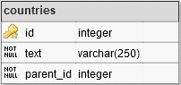

# Opis:

Aplikacja webowa do zarządzania strukturą drzewiastą, umożliwiająca:

- Dodawanie nowych węzłów do drzewa
- Rekursywne usuwanie węzłów z drzewa
- Przenoszenie węzłów do innych gałęzi
- Edycję nazwy węzłów
- Wyszukiwanie węzłów po nazwie
- Rozwijanie drzewa i wybranych gałęzi

# Wykorzystane technologie i biblioteki:

- PHP 7
- MySQL 5.7
- JavaScript
- HTML 5
- CSS
- [jsTree](https://www.jstree.com/)

# Zrzuty ekranu

# Konfiguracja bazy danych:

Aplikacja pobiera dane z działającej lokalnie bazy MySQL zawierającej tabelę o naastępującej strukturze:

Dane dostępowe można edytować w pliku [functions.php](functions.php).

Bazę danych można pobrać [tutaj](countries.sql).
