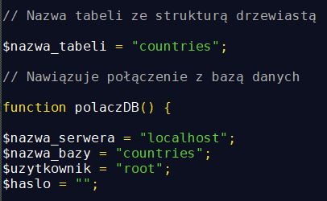

Aplikacja webowa umożlwiająca zarządzanie strukturą drzewiastą, umożliwiająca:

- Dodawanie nowych węzłów do drzewa
- Rekursywne usuwanie węzłów z drzewa
- Edycję nazwy węzłów
- Przenoszenie węzłów do innych gałęzi
- Rozwijanie / zwijanie gałęzi drzewa
- Wyszukiwanie węzła w drzewie po nazwie

# Demo

[Przejdź do strony z aplikacją](http://80.211.246.214/tree)

# Wykorzystane technologie i biblioteki:

- PHP 7
- MySQL 5.7
- JavaScript
- HTML 5
- CSS
- [jsTree](https://www.jstree.com/)

# Konfiguracja bazy danych:

Aplikacja pobiera dane z działającej lokalnie bazy MySQL zawierającej tabelę o naastępującej strukturze:

Dane dostępowe można edytować w pliku [functions.php](functions.php).

Przykładową bazę danych można pobrać [tutaj](countries.sql).
